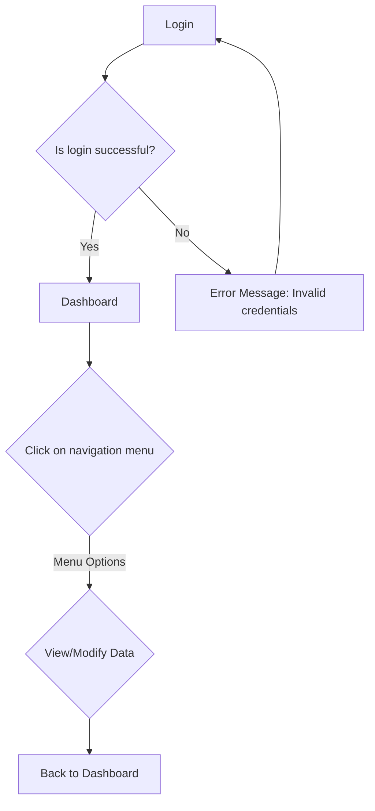

```mermaid
flowchart TD
    A[Login] --> B{Is login successful?}
    B -->|Yes| C[Dashboard]
    C --> D{Click on navigation menu}
    D -->|Menu Options| E{View/Modify Data}
    E --> F[Back to Dashboard]
    B -->|No| G[Error Message: Invalid credentials]
    G --> A
```