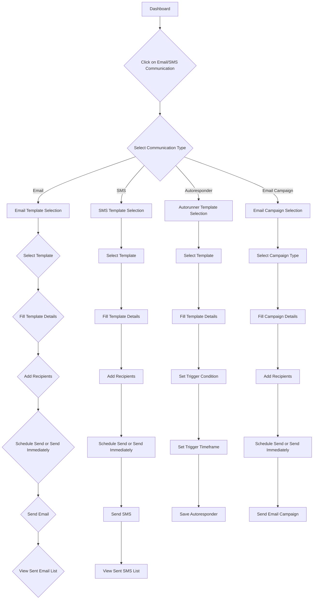

```mermaid
flowchart TD
    A[Dashboard] --> B{Click on Email/SMS Communication}
    B --> C{Select Communication Type}
    C --> |Email| D[Email Template Selection]
    D --> E{Select Template}
    E --> F{Fill Template Details}
    F --> G{Add Recipients}
    G --> H{Schedule Send or Send Immediately}
    H --> I{Send Email}
    I --> J{View Sent Email List}
    
    C --> |SMS| K[SMS Template Selection]
    K --> L[Select Template]
    L --> M[Fill Template Details]
    M --> N[Add Recipients]
    N --> O[Schedule Send or Send Immediately]
    O --> P[Send SMS]
    P --> Q[View Sent SMS List]

    C --> |Autoresponder| R[Autorunner Template Selection]
    R --> S[Select Template]
    S --> T[Fill Template Details]
    T --> U[Set Trigger Condition]
    U --> V[Set Trigger Timeframe]
    V --> W[Save Autoresponder]
    
    C --> |Email Campaign| X[Email Campaign Selection]
    X --> Y[Select Campaign Type]
    Y --> Z[Fill Campaign Details]
    Z --> AA[Add Recipients]
    AA --> BB[Schedule Send or Send Immediately]
    BB --> CC[Send Email Campaign]
```