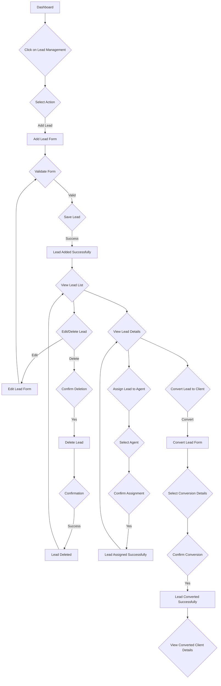

```mermaid
flowchart TD
    A[Dashboard] --> B{Click on Lead Management}
    B --> C{Select Action}
    C --> |Add Lead| D[Add Lead Form]
    D --> E{Validate Form}
    E --> |Valid| F{Save Lead}
    F -->|Success| G[Lead Added Successfully]
    G -->H{View Lead List}
    H -->I{Edit/Delete Lead}
    I --> |Edit| J[Edit Lead Form]
    J --> E
    I --> |Delete| K{Confirm Deletion}
    K --> |Yes| L[Delete Lead]
    L --> M{Confirmation}
    M --> |Success| N[Lead Deleted]
    N --> H
    H --> O{View Lead Details}
    O --> P{Assign Lead to Agent}
    P --> Q{Select Agent}
    Q --> R{Confirm Assignment}
    R --> |Yes| S[Lead Assigned Successfully]
    S --> O
    O --> T{Convert Lead to Client}
    T --> |Convert| U[Convert Lead Form]
    U --> V{Select Conversion Details}
    V --> W{Confirm Conversion}
    W --> |Yes| X[Lead Converted Successfully]
    X --> Y{View Converted Client Details}
```