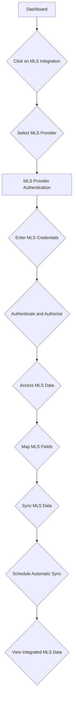

```mermaid
flowchart TD
    A[Dashboard] --> B{Click on MLS Integration}
    B --> C{Select MLS Provider}
    C --> D[MLS Provider Authentication]
    D --> E{Enter MLS Credentials}
    E --> F{Authenticate and Authorize}
    F --> G{Access MLS Data}
    G --> H{Map MLS Fields}
    H --> I{Sync MLS Data}
    I --> J{Schedule Automatic Sync}
    J --> K{View Integrated MLS Data}
```