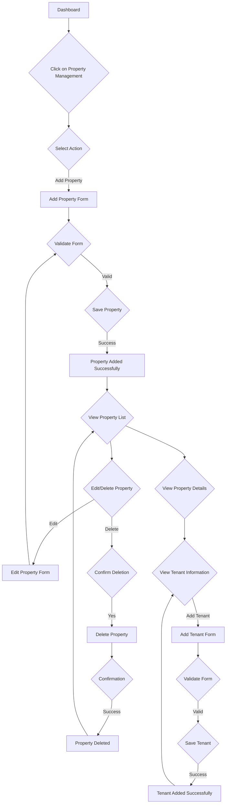

```mermaid
flowchart TD
    A[Dashboard] --> B{Click on Property Management}
    B --> C{Select Action}
    C --> |Add Property| D[Add Property Form]
    D --> E{Validate Form}
    E --> |Valid| F{Save Property}
    F -->|Success| G[Property Added Successfully]
    G -->H{View Property List}
    H -->I{Edit/Delete Property}
    I --> |Edit| J[Edit Property Form]
    J --> E
    I --> |Delete| K{Confirm Deletion}
    K --> |Yes| L[Delete Property]
    L --> M{Confirmation}
    M --> |Success| N[Property Deleted]
    N --> H
    H --> O{View Property Details}
    O --> P{View Tenant Information}
    P --> |Add Tenant| Q[Add Tenant Form]
    Q --> R{Validate Form}
    R --> |Valid| S{Save Tenant}
    S --> |Success| T[Tenant Added Successfully]
    T --> P
```