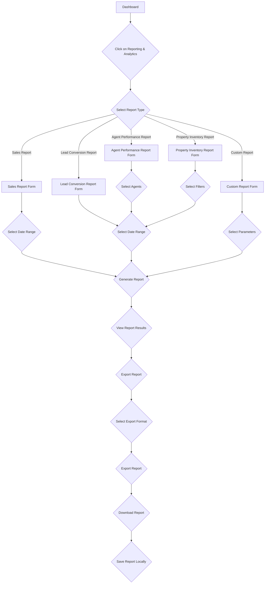

```mermaid
flowchart TD
    A[Dashboard] --> B{Click on Reporting & Analytics}
    B --> C{Select Report Type}
    C --> |Sales Report| D[Sales Report Form]
    D --> E{Select Date Range}
    E --> F{Generate Report}
    F --> G{View Report Results}
    G --> H{Export Report}
    H --> I{Select Export Format}
    I --> J{Export Report}
    J --> K{Download Report}
    K --> L{Save Report Locally}
    
    C --> |Lead Conversion Report| M[Lead Conversion Report Form]
    M --> N{Select Date Range}
    N --> F
    
    C --> |Agent Performance Report| O[Agent Performance Report Form]
    O --> P{Select Agents}
    P --> N
    
    C --> |Property Inventory Report| Q[Property Inventory Report Form]
    Q --> R{Select Filters}
    R --> N

    C --> |Custom Report| S[Custom Report Form]
    S --> T{Select Parameters}
    T --> F
```