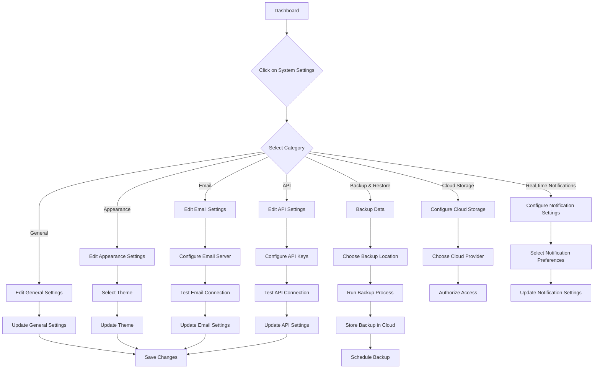

```mermaid
flowchart TD
    A[Dashboard] --> B{Click on System Settings}
    B --> C{Select Category}
    C --> |General| D[Edit General Settings]
    D --> E[Update General Settings]
    E --> F[Save Changes]
    
    C --> |Appearance| G[Edit Appearance Settings]
    G --> H[Select Theme]
    H --> I[Update Theme]
    I --> F[Save Changes]
    
    C --> |Email| J[Edit Email Settings]
    J --> K[Configure Email Server]
    K --> L[Test Email Connection]
    L --> M[Update Email Settings]
    M --> F[Save Changes]
    
    C --> |API| N[Edit API Settings]
    N --> O[Configure API Keys]
    O --> P[Test API Connection]
    P --> Q[Update API Settings]
    Q --> F[Save Changes]
    
    C --> |Backup & Restore| R[Backup Data]
    R --> S[Choose Backup Location]
    S --> T[Run Backup Process]
    T --> U[Store Backup in Cloud]
    U --> V[Schedule Backup]
    
    C --> |Cloud Storage| W[Configure Cloud Storage]
    W --> X[Choose Cloud Provider]
    X --> Y[Authorize Access]
    
    C --> |Real-time Notifications| Z[Configure Notification Settings]
    Z --> AA[Select Notification Preferences]
    AA --> AB[Update Notification Settings]
```