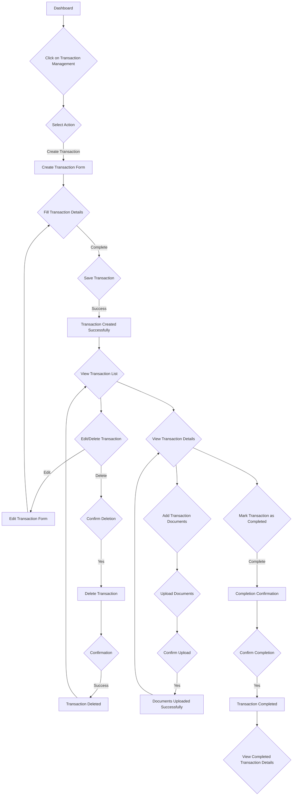

```mermaid
flowchart TD
    A[Dashboard] --> B{Click on Transaction Management}
    B --> C{Select Action}
    C --> |Create Transaction| D[Create Transaction Form]
    D --> E{Fill Transaction Details}
    E --> |Complete| F{Save Transaction}
    F -->|Success| G[Transaction Created Successfully]
    G -->H{View Transaction List}
    H -->I{Edit/Delete Transaction}
    I --> |Edit| J[Edit Transaction Form]
    J --> E
    I --> |Delete| K{Confirm Deletion}
    K --> |Yes| L[Delete Transaction]
    L --> M{Confirmation}
    M --> |Success| N[Transaction Deleted]
    N --> H
    H --> O{View Transaction Details}
    O --> P{Add Transaction Documents}
    P --> Q{Upload Documents}
    Q --> R{Confirm Upload}
    R --> |Yes| S[Documents Uploaded Successfully]
    S --> O
    O --> T{Mark Transaction as Completed}
    T --> |Complete| U[Completion Confirmation]
    U --> V{Confirm Completion}
    V --> |Yes| W[Transaction Completed]
    W --> X{View Completed Transaction Details}
```