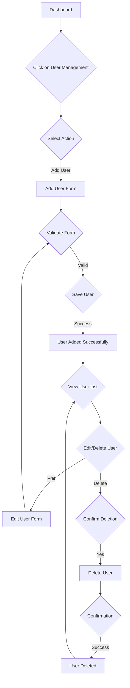

```mermaid
flowchart TD
    A[Dashboard] --> B{Click on User Management}
    B --> C{Select Action}
    C --> |Add User| D[Add User Form]
    D --> E{Validate Form}
    E --> |Valid| F{Save User}
    F -->|Success| G[User Added Successfully]
    G -->H{View User List}
    H -->I{Edit/Delete User}
    I --> |Edit| J[Edit User Form]
    J --> E
    I --> |Delete| K{Confirm Deletion}
    K --> |Yes| L[Delete User]
    L --> M{Confirmation}
    M --> |Success| N[User Deleted]
    N --> H
```